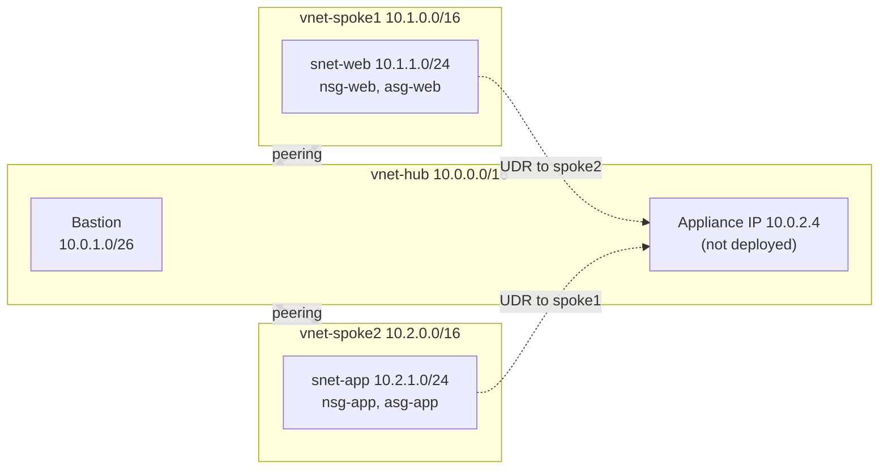

# azure-hub-spoke-network


Hub-spoke Azure network in Bicep: peering, NSGs with ASGs, Bastion, UDRs

## Architecture



## Design decisions

- **Non-overlapping /16 per VNet.** Peering requires address spaces that don't overlap.
- **Peering in both directions.** One side alone stays Initiated. Forwarded traffic is allowed so a hub appliance can pass traffic between spokes.
- **Route tables on each spoke.** Peering isn't transitive, so spoke-to-spoke traffic is sent to the hub appliance IP (10.0.2.4).
- **ASGs as rule destinations.** Rules target the web or app servers as a group, not by IP. The web-to-app rule uses the web subnet range as its source, because a rule can't use ASGs on both sides across VNets.
- **Explicit deny at priority 4000.** The default AllowVnetInBound (65000) allows all traffic from peered VNets. This rule closes that gap after the specific allows.
- **Bastion instead of public IPs.** VMs have no public IPs; SSH is allowed only from AzureBastionSubnet.

## Verified deployment

Deployed once to Central India with a test VM in spoke 1, checked, then deleted.

- Both hub peerings showed **Connected**.
- Effective routes on the spoke 1 VM: 10.0.0.0/16 via **VNet peering**, and 10.2.0.0/16 via the **User** route `to-spoke2`.
- The `to-spoke2` route showed next hop type **None**, because no appliance exists at 10.0.2.4. Spoke-to-spoke traffic is dropped until an appliance with IP forwarding is deployed there. The appliance is not part of this repo.
- SSH through Bastion to the spoke 1 VM worked: `Allow-Bastion-SSH` matched through `asg-web`.

## Deploy

```bash
az group create --name rg-hubspoke --location centralindia
az deployment group create --resource-group rg-hubspoke --template-file main.bicep
```

## Clean up

Bastion is billed by the hour, so delete everything when you're done:

```bash
az group delete --name rg-hubspoke --yes --no-wait
```