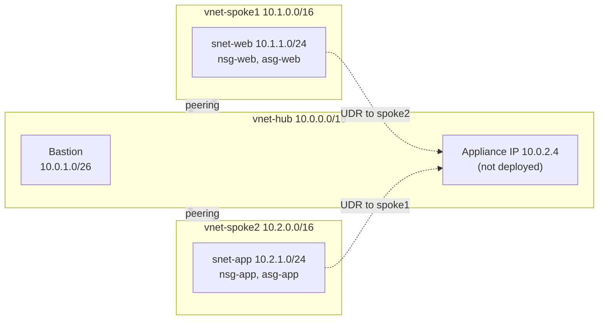

# azure-hub-spoke-network

Hub-spoke Azure network in Bicep: peering, NSGs with ASGs, Bastion, UDRs

## Architecture

```mermaid
flowchart LR
  subgraph hub["vnet-hub 10.0.0.0/16"]
    bas["Bastion<br/>10.0.1.0/26"]
    nva["Appliance IP 10.0.2.4<br/>(not deployed)"]
  end
  subgraph s1["vnet-spoke1 10.1.0.0/16"]
    web["snet-web 10.1.1.0/24<br/>nsg-web, asg-web"]
  end
  subgraph s2["vnet-spoke2 10.2.0.0/16"]
    app["snet-app 10.2.1.0/24<br/>nsg-app, asg-app"]
  end
  hub <-->|peering| s1
  hub <-->|peering| s2
  web -.->|UDR to spoke2| nva
  app -.->|UDR to spoke1| nva
```